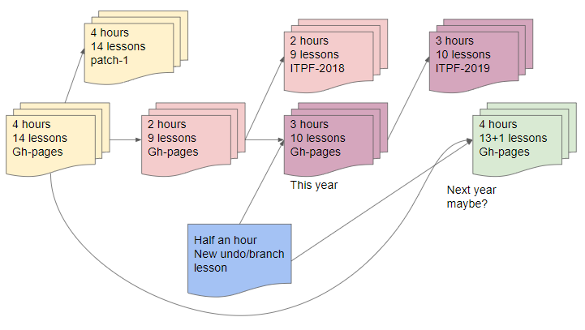
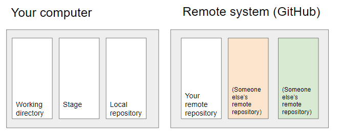
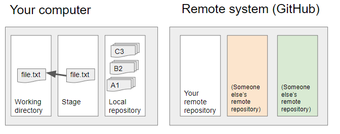
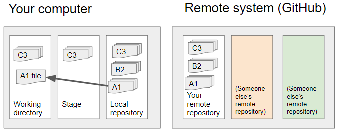
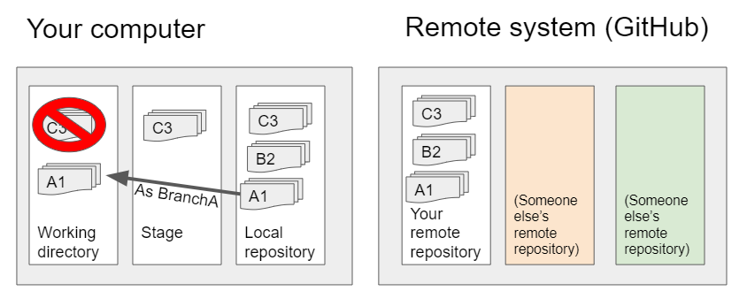
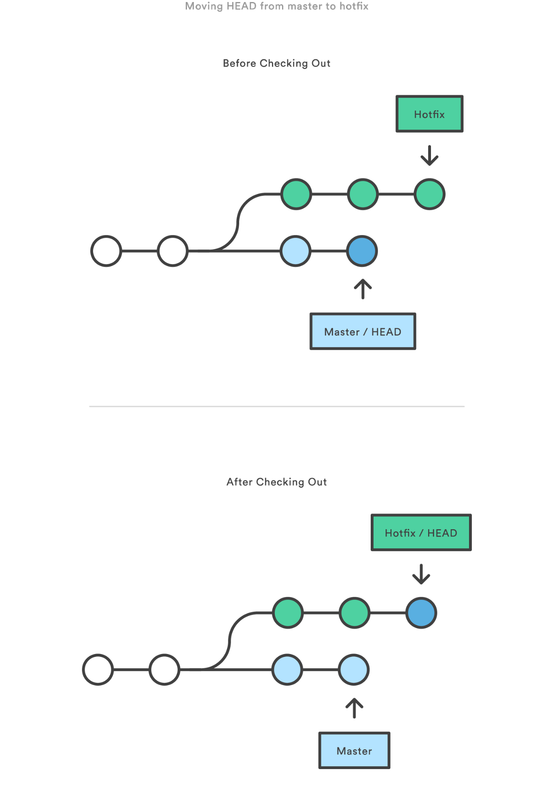
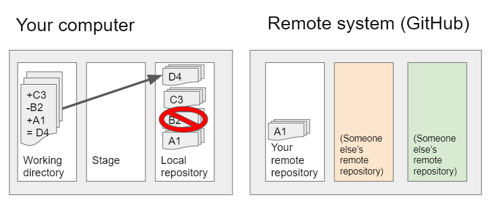

Two of the key elements of version control are being able to get back to a previous version when you want it, and being able to try out different options from whatever point you’d like to revisit.

GitHub makes it easy to look around your version history to see what the entire repository looks like at different points in time. 

To use this lesson as an example, the original Software Carpentry edition of this class was designed to be 4 hours long and had 14 lessons in it: [https://github.com/dlstrong/git-novice/tree/patch-1/_episodes](https://github.com/dlstrong/git-novice/tree/patch-1/_episodes)

However, for the Spring 2018 IT Pro Forum edition, I needed to fit the class into 2 hours, so I simplified the setup based on the availability of the Siebel labs and cut 5 lessons out: [https://github.com/dlstrong/git-novice/tree/it-pro-forum-2018/_episodes](https://github.com/dlstrong/git-novice/tree/it-pro-forum-2018/_episodes)

This year we have up to 3 hours for the introduction, so I’m adding in new information that wasn’t included in any previous Software Carpentry edition of Git (this page).

In the future, I might want to add this page into a 4-hour edition of the class and take something else out. But the page you see at https://dlstrong.github.io/git-novice only displays the most recent thing in the “gh-pages” branch, meaning that if I want to show the 4-hour edition in the web page instead, I’d need to grab that version out of the repository history and copy it to the newest point in the gh-pages branch again.

At the time of this writing, my version of the lesson is “77 commits ahead and 564 commits behind” the Software Carpentry lesson, based on Steve Bond (biologyguy)’s particular fork rather than the main repository. That’s a lot of differences to go through and compare, if and when I’m trying to find this version later. So I use branching and tagging and releases to mark different editions that I can easily get hold of later. 

Each of the versions could be developed independently of each other, or an update to one page could be shared across each of them. For a visual example:



(The original version is yellow; the cut-in-half version is pink. When you add a new blue lesson to the pink version you get the purple version. When you add that blue lesson to a trim of the yellow version, you get green. Gh-pages is the name of the branch that github.io watches for updates to what’s published on the live website, so other versions need to be put in other branches/tags.)

So in order to be able to manage your versions like this, you need to be able to do four things:

1. Identify which parts of the history you want to reuse (ideally, they’ll be labeled)
2. Accurately get hold of those parts and bring them to your working space
3. Update your work 
4. Put it back in the repository (and ideally label that version as well)

There are several ways of labeling, depending on what you want to identify. Messages and tags stay with a particular commit; branch labels continue forward as progress on that branch proceeds. 

So if I’ve just marked the 2018 version of gh-pages with tag ITPF-2018, then start adding new content to the gh-pages branch for this session, the gh-pages _branch_ identity will still apply to the new content but the ITPF-2018 _tag_ will not. 

Understanding the label methods will help you navigate your history in order to find the spot in time you want to return to and select the content you want to access.


> ## Activity: Navigate versions in GitHub
>
> In [https://github.com/dlstrong/git-novice/tree/gh-pages/_episodes](https://github.com/dlstrong/git-novice/tree/gh-pages/_episodes), take a look at some of the different branches. Some of them will return 404 error messages.
>
> *   In some circumstances, switching to the **2015.08** branch returns an error message. In other circumstances it doesn’t. 
>    *   Can you figure out the pattern? 
> *   Starting from [https://github.com/dlstrong/git-novice/tree/gh-pages/_episodes](https://github.com/dlstrong/git-novice/tree/gh-pages/_episodes)  again, under the **Branch:gh-pages** drop menu, go to the **Tags** section and pick **it-pro-forum-2018**.
>    *   What else changed about your view when you chose that tag?
> *   How would you examine the differences between my **patch-1** and my **gh-pages**?  \
> (Hint: There’s a Compare link on the right, below the History button.) 
> *   How would you examine the differences between **my it-pro-forum-2018** and **biologyguy’s gh-pages**?
> *   Between Software Carpentry’s instance, biologyguy’s instance, and my instance, how would you identify the difference between what’s called a **fork**, what’s called a **branch**, and what’s called a **tag**? (Bonus points for explaining when and why you would use each.)
{: .challenge}

> ## Activity: Tags
>
> Let’s create some tags now, then make more changes so that you can grab that label as one of the options for later rolling-back. 
>
> On the command line, you can apply tags at any stage of development and to the whole repository or to individual commits within a repository. On GitHub.com, you can only create tags when you create releases, but you can navigate with tags that were created by the command line and pushed to the remote repository.
>
>
> ### Tagging your current state
>
> What command would you use to tag things as they are right now?
>
> (Name it something like v0.5.0. The table earlier in the lesson can help.)
>
> > ## Solution:
> >
> > `git tag -a v0.5.0 -m "I think we're halfway to a release"`
> {: .solution}
> 
> ### Tagging a couple of past commits
>
> Sometimes you don’t realize how significant something will be until later on. Let’s say we want to mark a version 0.2.0 as well. 
> Use GitHub interface’s History button to identify two earlier commits. (For example, [https://github.com/dlstrong/git-novice/commits/gh-pages/_episodes](https://github.com/dlstrong/git-novice/commits/gh-pages/_episodes) shows several commits on June 10, 2018 that could be selected. Your version history and hashes will be different.)
>
>
>
> 1. Use the clipboard button beside the hash code to copy it.
> 2. On the command line, use `git tag` to apply the tag “v0.2.0” to a commit you selected. (The table above can be used for reference.)
>
> > ## Solution:
> >
> > `git tag -a v0.2.0 -m "This may be useful later" <commit hash>`
> > (Substitute the actual hashes, and don’t put angle brackets around them.)
> {: .solution}
{: .challenge}

## Grabbing a specific version from different levels of storage

Now that we have different ways of labeling things, we need to look at how to get hold of the piece you want in the way you want it. Remember that you have basically 4 different spaces in Git (before considering forks and branches as additional spaces):



Git commands can be used to reset each of these spaces with individual commits, individual tags, and/or individual branches. Here are some of the commands used to reset these spaces:


<table>
  <tr>
   <td><strong>Command</strong>
   </td>
   <td><strong>Scope</strong>
   </td>
   <td><strong>Common use cases</strong>
   </td>
  </tr>
  <tr>
   <td><code>git checkout</code>
   </td>
   <td>Commit/branch/tag-level
   </td>
   <td>Switch between branches or inspect old versions
   </td>
  </tr>
  <tr>
   <td><code>git checkout</code>
   </td>
   <td>File-level
   </td>
   <td>Discard changes in the working directory
   </td>
  </tr>
  <tr>
   <td><code>git reset</code>
   </td>
   <td>Commit/branch/tag-level
   </td>
   <td>Discard commits in a private branch or throw away uncommited changes
   </td>
  </tr>
  <tr>
   <td><code>git reset</code>
   </td>
   <td>File-level
   </td>
   <td>Unstage a file
   </td>
  </tr>
  <tr>
   <td><code>git revert</code>
   </td>
   <td>Commit/branch/tag-level
   </td>
   <td>Undo commits in a public branch (or undo something you might want to refer to later)
   </td>
  </tr>
  <tr>
   <td><code>git revert</code>
   </td>
   <td>File-level
   </td>
   <td>(N/A)
   </td>
  </tr>
</table>


(Slightly modified from the source: [https://www.atlassian.com/git/tutorials/resetting-checking-out-and-reverting](https://www.atlassian.com/git/tutorials/resetting-checking-out-and-reverting) )


### Git checkout

Git checkout can be used on individual files, particular commits, or entire branches. In essence, it’s a “give me this other thing to look at or work with” command. It behaves slightly differently when you use it on an individual file or an entire commit.

To look at a particular version of a specific file, you include the file name (and/or its path as needed for disambiguation) in the command. This brings that version of the file into your working directory:

```
git checkout <description of which version> <filename>
```

If you don’t tell it which version of a file you want, it assumes you want to get the version in your **staging area**:


```
git checkout file.txt 
```

This will bring the staged version of `file.txt` back into your working directory.





If you tell checkout which version you want from your local repository, it will pull from that version rather than from the stage. To save commit lookup time, you can count how many versions back from your current HEAD pointer position you’d like to look -- for example,  HEAD~2 refers to two versions back from the latest commit in your currently active branch. 

So if commit C3 is the latest, and commit A1 is two before that, then here's how to get a copy of the A1 version of `file` and put it in your working directory, but leave the rest of your work at its current state:

```
git checkout HEAD~2 file
```



### Working with entire commits

If you decide that everything you’ve done since the last commit was a bad idea and you want to clear the decks and re-start from your last commit, you’d use this command to copy everything from commit C3 (the latest version and “HEAD” of the line) back into your working directory:

```
git checkout HEAD
```

In contrast, if you check out an entire commit that’s **older than the latest**, you’re probably going to want to name a branch while you do it to avoid developing in a detached HEAD state. (Just take my word for it right now. We’ll translate that into English later.)

**If you don’t have a branch already made** and you’d like to make a new branch, you use -b to name the branch during the checkout:


```
git checkout <some-commit> -b <branchname>
```

In this illustration, we’re getting version A1 by using HEAD~2 and naming the new branch BranchA during the checkout:

```
git checkout HEAD~2 -b BranchA 
```



Note the red Nope symbol over version C3 in the working directory? Those files will get overwritten with a checkout. 

If you want to save your changes temporarily -- or if Git gives you a warning that you’ve got changes it doesn’t want to overwrite with a checkout -- you can use `git stash` to put working directory changes in temporary holding. 

**If you already have a branch,** and you want to update your working directory to work on that branch, the command looks like this:


```
git checkout <branchname>
```


In the images below from Atlassian’s tutorial, we’re switching from the master branch to the hotfix branch by using `git checkout hotfix`:


<p id="gdcalert6" ><span style="color: red; font-weight: bold">>>>>>  gd2md-html alert: inline image link here (to images/Lesson-45.png). Store image on your image server and adjust path/filename if necessary. </span><br>(<a href="#">Back to top</a>)(<a href="#gdcalert7">Next alert</a>)<br><span style="color: red; font-weight: bold">>>>>> </span></p>





When you’re done working with the hotfix branch and have added and committed your change there, you can go back to the main branch by telling it that you want to check out “master” again:


```
git checkout master
```


### Checking out tags and specific hashes

Remember the version 0.2.0 and 0.5.0 tags we made in the earlier activity? You can check out tagged versions by telling Git that the identifying word you use is a tag name rather than a branch name:


```
git checkout tags/v0.2.0
```


or 


```
git checkout tags/itpf2019
```


 \
You can get a list of tag names in the GitHub.com interface or with the `git tag` command on the command line. 

(If your tag names and branch names are entirely different, you could also do `git checkout v0.2.0` without specifying tags/. However, if you don’t specify what type of label you mean, `git checkout`’s first guess is that you mean a branch name.)

If the hash for a particular commit is more readily available than the tag name or how far back in a branch the particular version is, you can also check out via hash code:


```
git checkout hash/a1b2c3d
```


or


```
git checkout a1b2c3d
```


(Generally speaking, your tag and branch names shouldn’t be the same as a hash, so you probably won’t need to tell git which type of identifier you’re using here.)


### Detached heads

In the picture above, you’ll notice that the word HEAD is pointing at the last bubble in each sequence. That means your HEAD is not detached. (This is usually a good idea both in git and in life.)

 What that means in English is that git has a branch name associated with the place that you’re working and that branch name will continue to be associated with the most recent changes as you make more commits. 

If you’re working under a detached HEAD that’s not pointing at the latest item in a named branch, git won’t know how to connect new commits to the rest of the tree. You can git checkout older versions without branch names (i.e. put yourself in a detached HEAD state) to look around the history, but you’re risking potential confusion if you make any changes from that point. 

I’d recommend using GitHub’s history features to explore past states when you can, and checking out into named branches to avoid chaos when you need to make changes starting from past states.


## Activity: Checking out different units


### Quiz: Understanding the syntax

Pair up numbers and letters to identify which checkout command is used for which purposes. (Some of them can have more than one answer, and some answers can be used more than once.)


<table>
  <tr>
   <td>Command
   </td>
   <td>Purpose
   </td>
  </tr>
  <tr>
   <td>(1) git checkout word
   </td>
   <td>(a) If “word” is a branch name, this command creates a new branch with that name.  
   </td>
  </tr>
  <tr>
   <td>(2) git checkout -b word
   </td>
   <td>(b) This command checks out the most recent commit in the branch you’re working on.
   </td>
  </tr>
  <tr>
   <td>(3) git checkout -b HEAD
   </td>
   <td>(c) If “word” is a branch name, this command changes your working directory to the most recent commit in that branch.
   </td>
  </tr>
  <tr>
   <td>(4) git checkout HEAD
   </td>
   <td>(d) If “word” is a file name, this command gets that file from the staging area.
   </td>
  </tr>
  <tr>
   <td>(5) git checkout HEAD word
   </td>
   <td>(e) If “word” is a branch name, this command checks out the second most recent commit and makes a new branch with that name. 
   </td>
  </tr>
  <tr>
   <td>(6) git checkout HEAD~1 
   </td>
   <td>(f) If “word” is a file name, this command checks out the version of that specific file from the commit you identified.
   </td>
  </tr>
  <tr>
   <td>(7) git checkout HEAD~1 -b word
   </td>
   <td>(g) This command checks out the second most recent commit in the branch 
   </td>
  </tr>
  <tr>
   <td>(8) git checkout HEAD~1 word
   </td>
   <td>(h) This command makes a new branch with your current working directory.
   </td>
  </tr>
  <tr>
   <td>
   </td>
   <td>(i) You probably don’t want to do this.
   </td>
  </tr>
</table>


 

**Solutions:**

1 - A, C: The outcome of this command depends on whether word is a file name or a branch name. If it’s a file name, it gets that file from the staging area. If it’s a branch name, it checks out that branch.

2 - H

3 - I: You probably don’t want to create a new branch called HEAD. That way lies madness.

4 - B

5 - F If “word” is a file name, checkout gets that file from the current HEAD of your branch, whether or not the head is detached. If “word” is a branch name, you might get a syntax error. 

6 - G, I: This is legal syntax but puts you in a detached HEAD state. You can use this to look around, but you probably don’t want to do this if you’re planning to develop from HEAD~1. Give it a branch name with -b to develop from here.

7 - E

8 - F


### Activity: Checking out an individual file

Let’s say you want to look at a past version of a particular file to see if that version works better for your needs. 


1. How would you identify which version of the file you want?
2. How would you tell git to bring that version back?

**Solutions:**


1. On the command line, you can use `git log` and `git diff` to inspect commit history and messages. On GitHub.com, the History and Compare options can help you navigate past versions and compare them to each other. \

2. If the version you want is on the stage but not in a commit, `git checkout <filename>` will get the staged version for you.  \
 \
If it’s recent enough to count the commits back, `git checkout HEAD~# <filename>` will select the version placed # of commits before the current one.  \
 \
If it’s further than you want to count, or if you have the commit hash ID or a tag handy, `git checkout <tag or hash>/<identifier> <filename>` will get that version.


### Activity: Check out a tag or a hash

Check out something you’ve tagged, and look around your working directory. Then check out something by using its hash code. 

When you’re done, change back to the master branch with: `git checkout master`

**Solutions:**


```
git checkout tags/<tagname>
```


and


```
git checkout hash/<hashcode>
```


 \
will tell git what type of labeling item you’re looking for. 


### Working at two points in time

Let’s say you’re working on a bug fix that isn’t ready to go live yet, but someone needs a patch for something that is live right now.


1. How would you save your current progress?
2. How would you identify the current live state that you want to roll back to?
3. How would you get that live state back for making the fix?
4. How would you return to your current project?

**Solutions:**

(Select the “empty” lines below to reveal the solutions.)


1. You can use the regular add-commit sequence to add your work to your active branch and make a new branch identity with `git checkout -b branchname`, or use `git stash` to make a temporary copy. (There are more options as well, but these are the two we’ve mentioned so far.) \

2. This depends on how you’ve labeled your releases, whether your master/HEAD is always your current release or whether you use tags, other branches, or the GitHub.com release labeling system for identification. (Labeling your releases will make your life simpler than leaving notes to future-you in commit messages!) \

3. After using `git status` to make sure you don’t have unsaved changes, you’ll want to `git checkout` the version you identified in step 2. \
 \
If you used GitHub.com’s Release system to make a release with a tag, you’ll want to get that tag identity copied to your local repository before you use it to check out and make a branch for it: \
 \
`git fetch --all --tags \
git checkout tags/<tag_name> -b <branch_name>`
4. After making your changes and committing them to that branch, you can use checkout to change back to your previous branch as well. \
 \
If you were working in the master branch before, the command would be: \
 \
`git checkout master`

     (If you weren’t using master, substitute the name of the branch you were working in.)


## Revert and Reset

Checkout lets you grab other things to work on, and test out different ways of doing things from various points in time. However, it doesn’t try to change the past.

Revert and reset are two different ways of saying “Whoops, that should not have happened at all. Let’s erase that (with varying amounts of eraser marks left behind).” 

In general:


*   ** Reset** is most useful when that thing needs to be undone on your **local computer** (by overwriting your working spaces from your local repository). If it hasn’t been pushed to a remote repository, you can take things out of your local history before they get pushed. Reset can apply to individual files or whole commits. \

*   **Revert** is most useful when that thing needs to be undone in a **shared repository** (by making a new commit that specifically undoes what a previous commit did). This is important in shared spaces because someone else’s work may depend on a particular commit continuing to exist, even if it’s not the latest commit. (Sometimes the person who needs that past commit can be you!) There is no file-level revert; it only works with whole commits. 

**SECURITY NOTE: If the thing that needs to be undone involved putting a file containing a password into GitHub.com, the very first thing you should do is change that password on that system, before you do anything else. **(There’s no way for ordinary mortals to beat the speed of the bots looking for passwords on GitHub.com.)

The checkout command grabs a copy from that earlier point in time, but git still remembers that the later commits exist. The reset command moves pointers so that git will forget those commits.

`git reset` offers three different methods of undoing things based on how much you’d like to change your stage and working directory.

`git reset`’s default `--mixed` behavior will update your stage, but leaves your working directory alone:

`git reset HEAD~2` 

or 

`git reset A1`  \
(implies `git reset --mixed HEAD~2 `or `A1`)


<p id="gdcalert7" ><span style="color: red; font-weight: bold">>>>>>  gd2md-html alert: inline image link here (to images/Lesson-46.png). Store image on your image server and adjust path/filename if necessary. </span><br>(<a href="#">Back to top</a>)(<a href="#gdcalert8">Next alert</a>)<br><span style="color: red; font-weight: bold">>>>>> </span></p>


 If you want to entirely clear the decks and make your working directory match your reset point as well, you want:

`git reset --hard HEAD~2` 

or 


```
git reset --hard A1
```


<p id="gdcalert8" ><span style="color: red; font-weight: bold">>>>>>  gd2md-html alert: inline image link here (to images/Lesson-47.png). Store image on your image server and adjust path/filename if necessary. </span><br>(<a href="#">Back to top</a>)(<a href="#gdcalert9">Next alert</a>)<br><span style="color: red; font-weight: bold">>>>>> </span></p>


## Activity: Variations of reset

Let’s look at the different versions of reset.


1. `git checkout` something
2. Make changes
3. `git add` your changes
4. `git status`
5. `git reset` (the default behavior is --mixed)
6. `git status`
7. `git add` (which will place the same files that you did in step 3)
8. `git status`
9. `git reset --hard`
10. `git status` 

What differences do you see between the --mixed and --hard versions?


## Revert

In contrast with reset, `revert` leaves all the commits available to the history, but creates a new commit that specifically undoes everything in a named commit (and leaves the rest of the commits in place). 

(This is important in a collaborative setting where other people may be relying on some of the commits that a `reset `would remove from the timeline.)

Note that unlike reset, which undoes everything between the commits, revert only undoes the commits that you specify. So if you have commits A1, B2, and C3, the command `git revert B2` will create a new commit D4 that includes A1 and C3. 


```
git revert B2
```


or


```
git revert HEAD~1
```


<p id="gdcalert9" ><span style="color: red; font-weight: bold">>>>>>  gd2md-html alert: inline image link here (to images/Lesson-48.png). Store image on your image server and adjust path/filename if necessary. </span><br>(<a href="#">Back to top</a>)(<a href="#gdcalert10">Next alert</a>)<br><span style="color: red; font-weight: bold">>>>>> </span></p>


If you want to revert everything since commit A1, you need to designate each commit to undo:


```
git revert B2 C3
```


or

`git revert HEAD~1 HEAD~2` 

<p id="gdcalert10" ><span style="color: red; font-weight: bold">>>>>>  gd2md-html alert: inline image link here (to images/Lesson-49.png). Store image on your image server and adjust path/filename if necessary. </span><br>(<a href="#">Back to top</a>)(<a href="#gdcalert11">Next alert</a>)<br><span style="color: red; font-weight: bold">>>>>> </span></p>





<!-- Docs to Markdown version 1.0β17 -->
