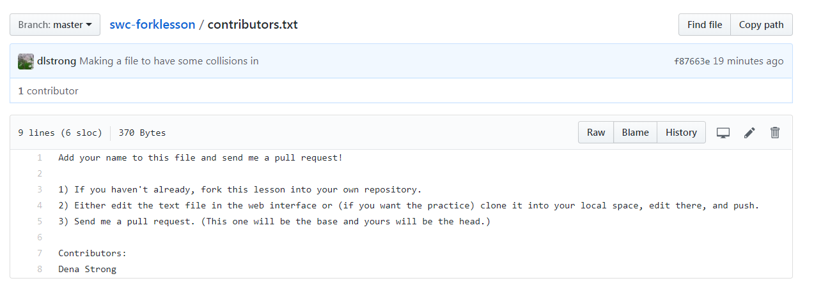

One of the strengths of open source software development is the ability to 
have many contributors helping with the project. However, if you gave every
contributor access to the same repository, it would be too easy for either
mistakes or malice to cause problems for the whole repository. 

GitHub helps solve this problem by allowing people to **fork** their own copy of a project,
work on it in their own space, and submit a **pull request** to the original
project in order to contribute without having to share too many permissions.

## Creating a fork

To create a fork of the repository we'll be experimenting with, go to https://github.com/dlstrong/swc-forklesson,
select the repository, and click on the 'fork' button:

For the demonstration's sake, we can make all our edits through the web interface. However, when you're
developing your own projects, you'll probably want a local working copy too. You can change to a directory that's
different from your previous project and clone the repository normally:

~~~
$ cd ~
$ mkdir forktest
$ cd forktest
$ git clone https://github.com/dlstrong/swc-forklesson.git
~~~
{: .bash}

(**Why you want to change directories:** If you're still in the same directory you
were just working in, that's where clone will put the new content too.
The cloned project could get really entangled with what you were just working on!)

Make changes to the files in this repository the same way you would in
 any other. This is now **your** copy of the code, to do whatever you
 like with (within the bounds of the license agreement, as will be
 discussed later). 

## Contributing to a repo via pull request

Let's add two contributions to the repository we just pulled from.

In the web interface, select the **contributors.txt** file and edit it 
to add your name to the list.

Also make a new file that has your name on it, i.e. **yourname.txt.**

You could now email the maintainer of the original repository to tell
 them about your updates, and they could use
 the unique hash identifier of your commit to pull those changes into
 their own code base, but GitHub makes the process much easier with
 **Pull Requests**.

&nbsp;

You'll use the Base Fork and Head Fork buttons to choose what to send where. (If you don't see those options, look for a link that says "If you need to, you can also compare across forks.")

* **Base fork:** The place you want to add information TO is the base fork. (In this case, it's the dlstrong version.)
* **Head fork:** The place you want to bring information FROM is the head fork. (In this case, it's your version.)

Compare the changes you want to add to your pull request and send it off.

(In the screen shots below, "deliciouslyevil" is the Dracula persona who's the repository maintainer
used in Software Carpentry examples, and "biologyguy" is the contributor who's submitting Kristin's
edits to the central collection.)

&nbsp;

&nbsp;

## Accepting a pull request

The maintainer will most likely get an email about the new pull request,
 but if they don't, it will be visible to them next time the log into
 GitHub:

&nbsp;

Accepting the request is as simple as hitting the green button, **BUT BE
 CAREFUL!**. Always look at the cimmit history, and check what changes
 are included in the pull request. You don't want the merge to break
 your code. Check the '`Commits`' and '`Files changed`' tabs to be sure.

&nbsp;

> ## Be wary of the big green button
>
> Try to think of some reasons you may want to reject a pull request.
{: .challenge}


